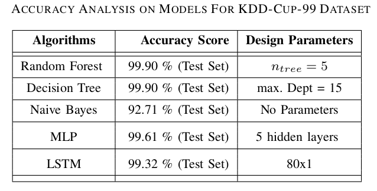
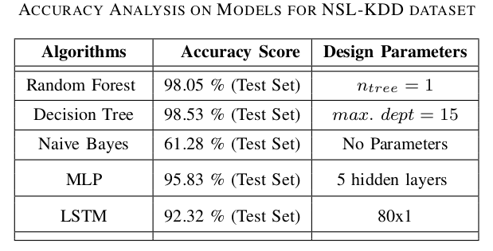

# *A Efficient Approach for Intrusion Detection in Sensor Networks*
## ECE 659 [Intelligent Sensors and Sensor Networks] Project

## Overview

In this study, we choose an efficient algorithm from different Artificial Intelligence and Machine Learning algorithms (AI&ML) for multi-class classification of different Denial of Service (DoS) Intrusions detection based on lowest Computational Complexity while considering the performance of the algorithm for multi- class classification as WSNs have limited resources allocated to it.

## Outcome:
For efficient model selection, 5 different AI and ML models were presented. Among the AI and ML models, it is evident that the ML Models outperform the AI models in terms of Accuracy score, F1-score and RoC curve analysis for Multiclass classification for both the datasets. 

### ACCURACY ANALYSIS ON MODELS FOR NSL-KDD DATASET & KDD-C UP -99 DATASET
 

  
     

